Arrest Probability Analysis
================
Sara Stoudt
3/10/2021

## Setup

``` r
#install.packages("tidyverse") ## install if haven't already done so
#install.pacakges("mgcv") ## install if haven't already done so
#install.pacakges("lubridate") ## install if haven't already done so

library(tidyverse)
library(mgcv)
library(lubridate)
```

``` r
load("../Data/arrests.Rdata") ## this will take a little time, it's a lot of data
## resulting data will be called SC_for_analysis

SC_for_analysis$day_of_week_num <- as.numeric(SC_for_analysis$day_of_week)
SC_for_analysis$doy <- yday(SC_for_analysis$stop_date)

dim(SC_for_analysis)
```

    ## [1] 1091424      46

## First BAM

``` r
gam1 <- bam(
  formula = arrest ~ race + driver_gender + s(driver_age) +
    post_policy + race * post_policy,
  data = SC_for_analysis,
  family = "binomial"
)
summary(gam1)
```

    ## 
    ## Family: binomial 
    ## Link function: logit 
    ## 
    ## Formula:
    ## arrest ~ race + driver_gender + s(driver_age) + post_policy + 
    ##     race * post_policy
    ## 
    ## Parametric coefficients:
    ##                          Estimate Std. Error  z value Pr(>|z|)    
    ## (Intercept)              -5.00333    0.02210 -226.430  < 2e-16 ***
    ## raceBlack                 0.44409    0.02205   20.144  < 2e-16 ***
    ## raceHispanic              1.15100    0.03171   36.298  < 2e-16 ***
    ## driver_genderM            1.22071    0.01902   64.178  < 2e-16 ***
    ## post_policy               0.00109    0.01863    0.059  0.95333    
    ## raceBlack:post_policy    -0.14014    0.02880   -4.866 1.14e-06 ***
    ## raceHispanic:post_policy  0.11335    0.03974    2.852  0.00434 ** 
    ## ---
    ## Signif. codes:  0 '***' 0.001 '**' 0.01 '*' 0.05 '.' 0.1 ' ' 1
    ## 
    ## Approximate significance of smooth terms:
    ##                 edf Ref.df Chi.sq p-value    
    ## s(driver_age) 7.285  7.694   1594  <2e-16 ***
    ## ---
    ## Signif. codes:  0 '***' 0.001 '**' 0.01 '*' 0.05 '.' 0.1 ' ' 1
    ## 
    ## R-sq.(adj) =  0.0135   Deviance explained = 5.26%
    ## fREML = 1.5518e+06  Scale est. = 1         n = 1090998

``` r
gam.check(gam1) ## now this is expensive, hm...
```

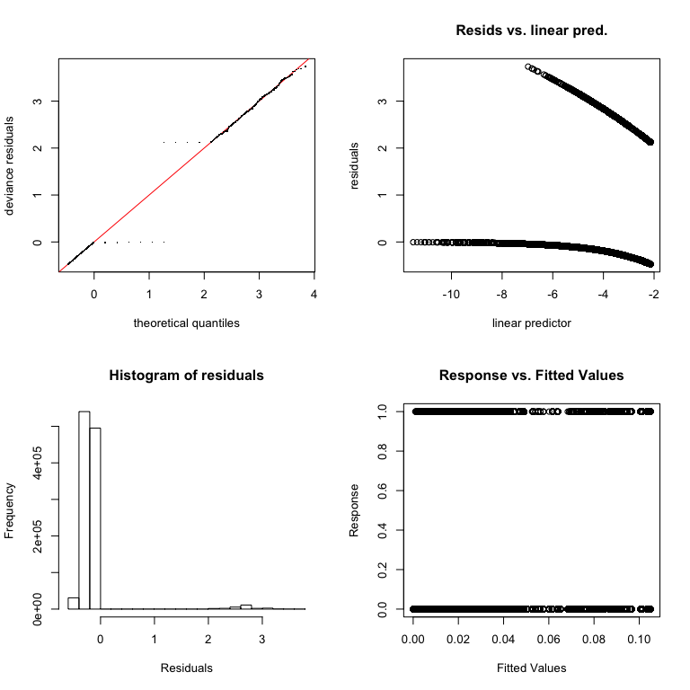<!-- -->

    ## 
    ## Method: fREML   Optimizer: perf newton
    ## full convergence after 5 iterations.
    ## Gradient range [0.0142286,0.0142286]
    ## (score 1551849 & scale 1).
    ## Hessian positive definite, eigenvalue range [2.271018,2.271018].
    ## Model rank =  16 / 16 
    ## 
    ## Basis dimension (k) checking results. Low p-value (k-index<1) may
    ## indicate that k is too low, especially if edf is close to k'.
    ## 
    ##                 k'  edf k-index p-value
    ## s(driver_age) 9.00 7.29    0.91    0.17

``` r
plot(gam1, rug = T)
```

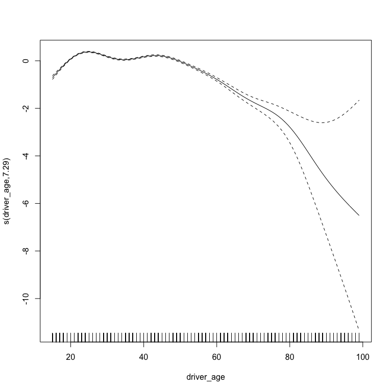<!-- -->

## The Works

``` r
gam2 <- bam(
  formula = arrest ~ race + driver_gender + s(driver_age, bs = "cr") +
    post_policy + race * post_policy +
    s(doy, bs = "cc") + s(day, bs = "cc") + s(day_of_week_num, bs = "cc", k = 4),
  data = SC_for_analysis,
  family = "binomial"
)

summary(gam2)
```

    ## 
    ## Family: binomial 
    ## Link function: logit 
    ## 
    ## Formula:
    ## arrest ~ race + driver_gender + s(driver_age, bs = "cr") + post_policy + 
    ##     race * post_policy + s(doy, bs = "cc") + s(day, bs = "cc") + 
    ##     s(day_of_week_num, bs = "cc", k = 4)
    ## 
    ## Parametric coefficients:
    ##                          Estimate Std. Error  z value Pr(>|z|)    
    ## (Intercept)              -4.99805    0.02212 -225.955  < 2e-16 ***
    ## raceBlack                 0.44230    0.02205   20.057  < 2e-16 ***
    ## raceHispanic              1.14455    0.03173   36.073  < 2e-16 ***
    ## driver_genderM            1.21938    0.01902   64.098  < 2e-16 ***
    ## post_policy              -0.01294    0.01873   -0.691  0.48964    
    ## raceBlack:post_policy    -0.14216    0.02880   -4.935    8e-07 ***
    ## raceHispanic:post_policy  0.11263    0.03976    2.833  0.00461 ** 
    ## ---
    ## Signif. codes:  0 '***' 0.001 '**' 0.01 '*' 0.05 '.' 0.1 ' ' 1
    ## 
    ## Approximate significance of smooth terms:
    ##                      edf Ref.df  Chi.sq p-value    
    ## s(driver_age)      7.349  7.792 1594.73  <2e-16 ***
    ## s(doy)             6.369  8.000   70.90  <2e-16 ***
    ## s(day)             6.562  8.000   40.58  <2e-16 ***
    ## s(day_of_week_num) 1.979  2.000  211.67  <2e-16 ***
    ## ---
    ## Signif. codes:  0 '***' 0.001 '**' 0.01 '*' 0.05 '.' 0.1 ' ' 1
    ## 
    ## R-sq.(adj) =  0.0139   Deviance explained = 5.41%
    ## fREML = 1.5517e+06  Scale est. = 1         n = 1090998

``` r
gam.check(gam2)
```

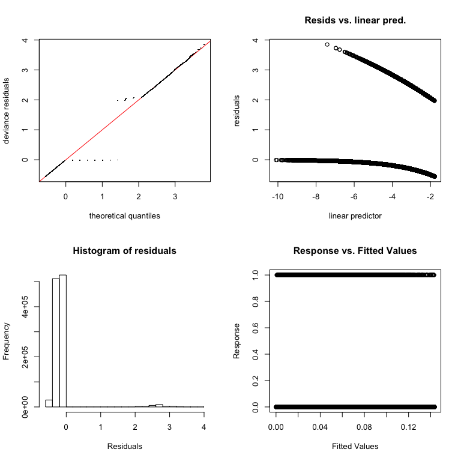<!-- -->

    ## 
    ## Method: fREML   Optimizer: perf newton
    ## full convergence after 5 iterations.
    ## Gradient range [5.781809e-08,0.0002733084]
    ## (score 1553285 & scale 1).
    ## Hessian positive definite, eigenvalue range [0.4995186,3.648384].
    ## Model rank =  37 / 37 
    ## 
    ## Basis dimension (k) checking results. Low p-value (k-index<1) may
    ## indicate that k is too low, especially if edf is close to k'.
    ## 
    ##                      k'  edf k-index p-value  
    ## s(driver_age)      9.00 7.32    0.92    0.06 .
    ## s(doy)             9.00 6.87    0.93    0.40  
    ## s(day)             9.00 5.14    0.96    0.99  
    ## s(day_of_week_num) 3.00 2.94    0.93    0.28  
    ## ---
    ## Signif. codes:  0 '***' 0.001 '**' 0.01 '*' 0.05 '.' 0.1 ' ' 1

``` r
plot(gam2, rug = T)
```

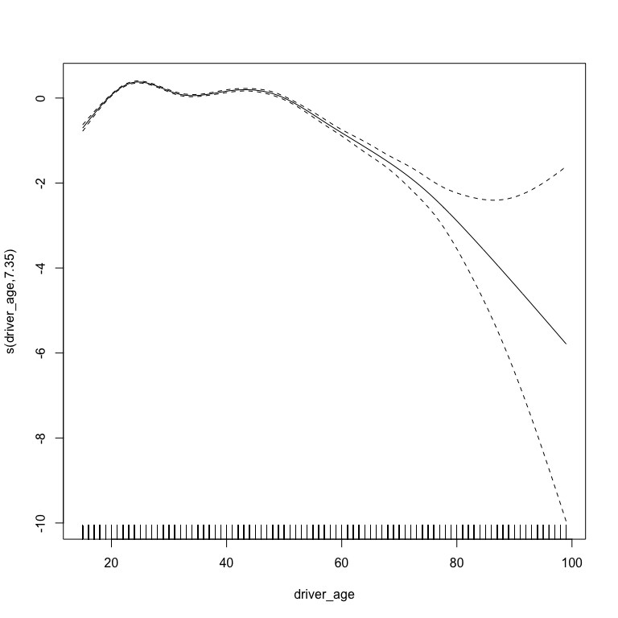<!-- --><!-- -->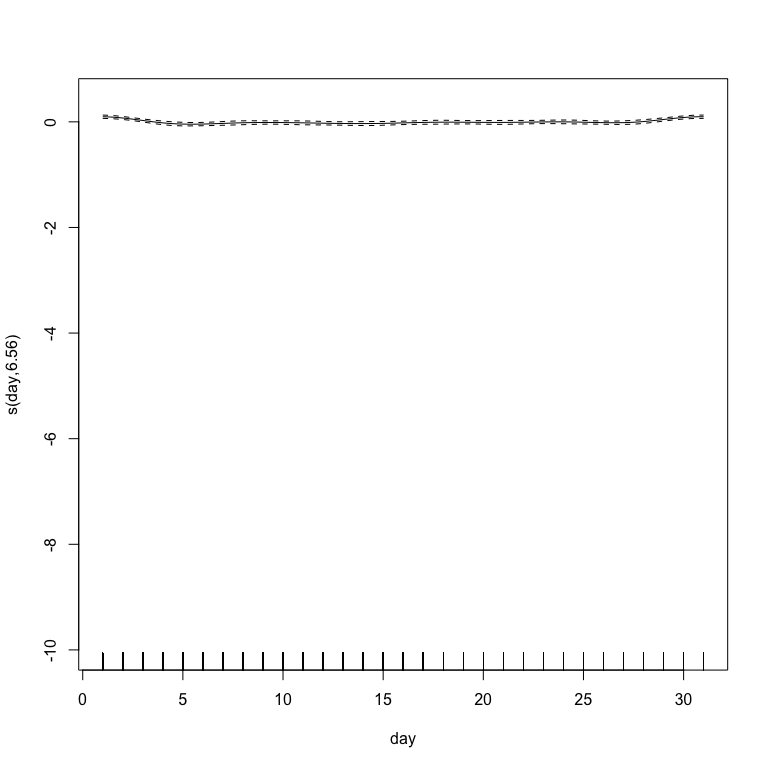<!-- -->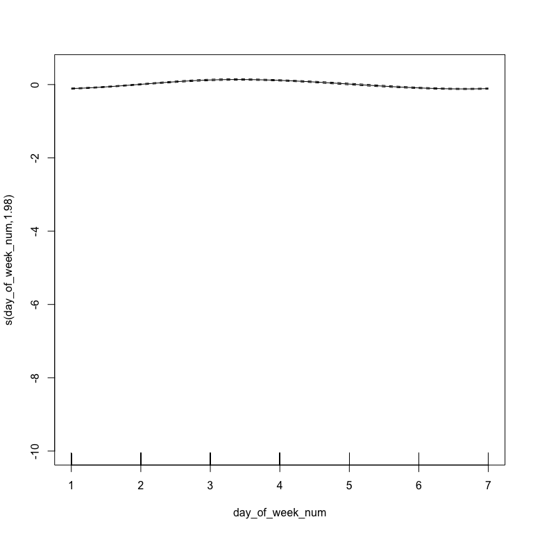<!-- -->

## The Works - Shrinkage

``` r
gam3 <- bam(
  formula = arrest ~ race + driver_gender + s(driver_age, bs = "cs") +
    post_policy + race * post_policy +
    s(doy, bs = "cs") + s(day, bs = "cs") + s(day_of_week_num, bs = "cs", k = 4),
  data = SC_for_analysis,
  family = "binomial"
)

summary(gam3)
```

    ## 
    ## Family: binomial 
    ## Link function: logit 
    ## 
    ## Formula:
    ## arrest ~ race + driver_gender + s(driver_age, bs = "cs") + post_policy + 
    ##     race * post_policy + s(doy, bs = "cs") + s(day, bs = "cs") + 
    ##     s(day_of_week_num, bs = "cs", k = 4)
    ## 
    ## Parametric coefficients:
    ##                          Estimate Std. Error  z value Pr(>|z|)    
    ## (Intercept)              -4.99513    0.02216 -225.455  < 2e-16 ***
    ## raceBlack                 0.44050    0.02206   19.973  < 2e-16 ***
    ## raceHispanic              1.13848    0.03174   35.872  < 2e-16 ***
    ## driver_genderM            1.21704    0.01903   63.967  < 2e-16 ***
    ## post_policy              -0.02444    0.01890   -1.293   0.1959    
    ## raceBlack:post_policy    -0.14117    0.02881   -4.900 9.56e-07 ***
    ## raceHispanic:post_policy  0.11087    0.03977    2.788   0.0053 ** 
    ## ---
    ## Signif. codes:  0 '***' 0.001 '**' 0.01 '*' 0.05 '.' 0.1 ' ' 1
    ## 
    ## Approximate significance of smooth terms:
    ##                      edf Ref.df  Chi.sq p-value    
    ## s(driver_age)      7.321      9 1579.92  <2e-16 ***
    ## s(doy)             6.873      9  104.08  <2e-16 ***
    ## s(day)             5.137      9   31.52  <2e-16 ***
    ## s(day_of_week_num) 2.938      3  429.58  <2e-16 ***
    ## ---
    ## Signif. codes:  0 '***' 0.001 '**' 0.01 '*' 0.05 '.' 0.1 ' ' 1
    ## 
    ## R-sq.(adj) =  0.0144   Deviance explained = 5.53%
    ## fREML = 1.5533e+06  Scale est. = 1         n = 1090998

``` r
gam.check(gam3)
```

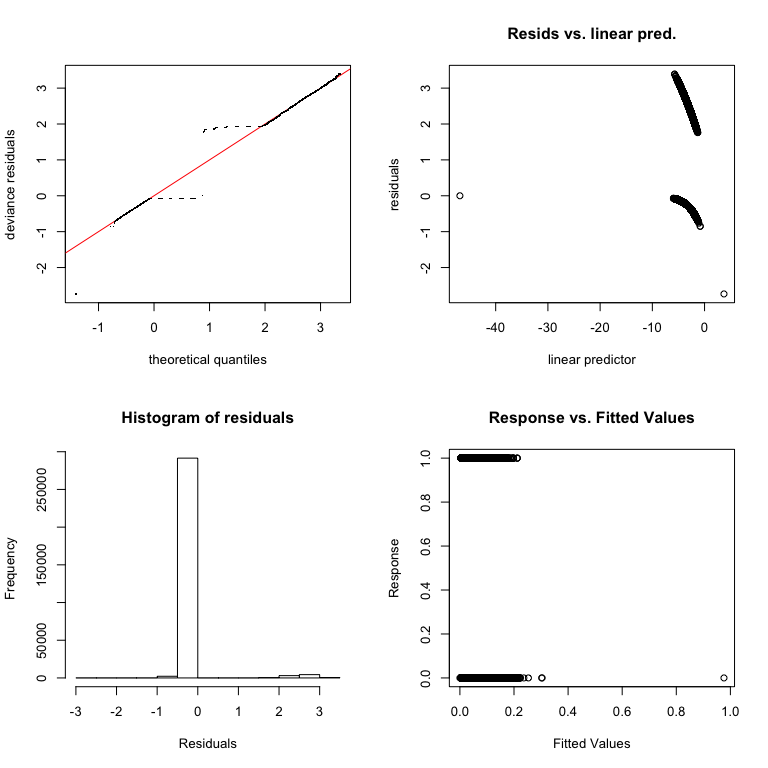<!-- -->

    ## 
    ## Method: fREML   Optimizer: perf newton
    ## full convergence after 6 iterations.
    ## Gradient range [3.131931e-07,2.1352e-05]
    ## (score 429997.5 & scale 1).
    ## Hessian positive definite, eigenvalue range [2.170075,3.098868].
    ## Model rank =  31 / 31 
    ## 
    ## Basis dimension (k) checking results. Low p-value (k-index<1) may
    ## indicate that k is too low, especially if edf is close to k'.
    ## 
    ##               k'  edf k-index p-value  
    ## te(lon,lat) 24.0 21.3    0.84   0.025 *
    ## ---
    ## Signif. codes:  0 '***' 0.001 '**' 0.01 '*' 0.05 '.' 0.1 ' ' 1

``` r
plot(gam3, rug = T)
```

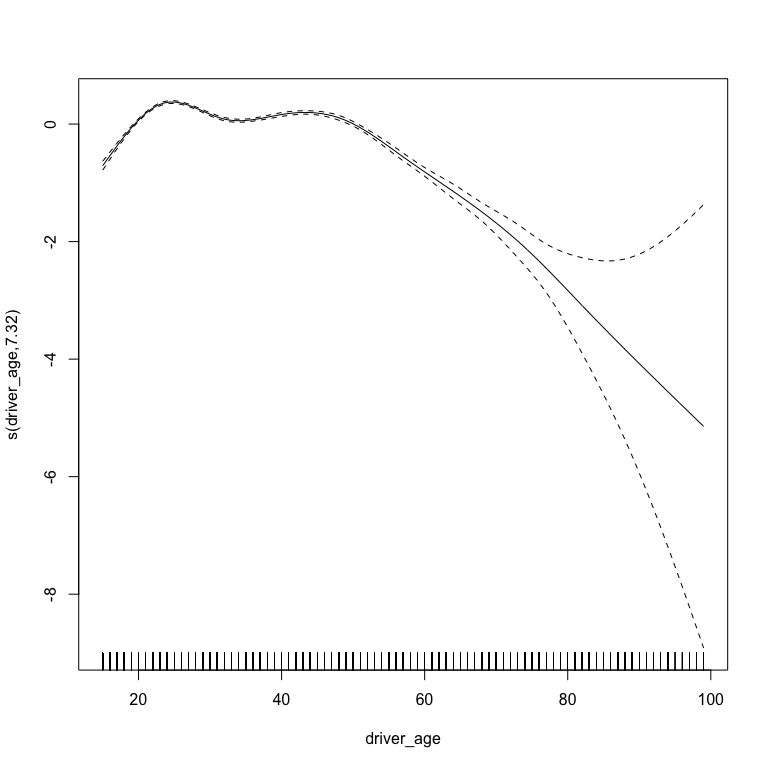<!-- -->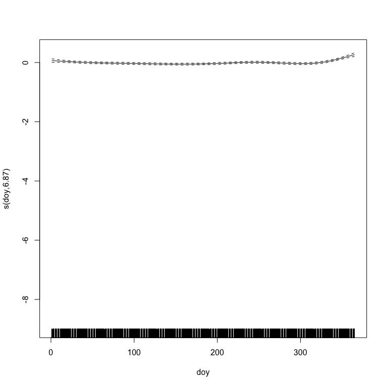<!-- -->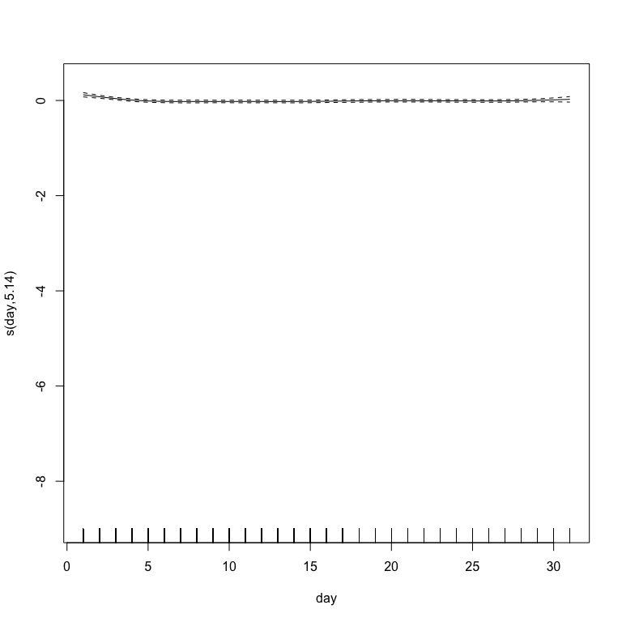<!-- -->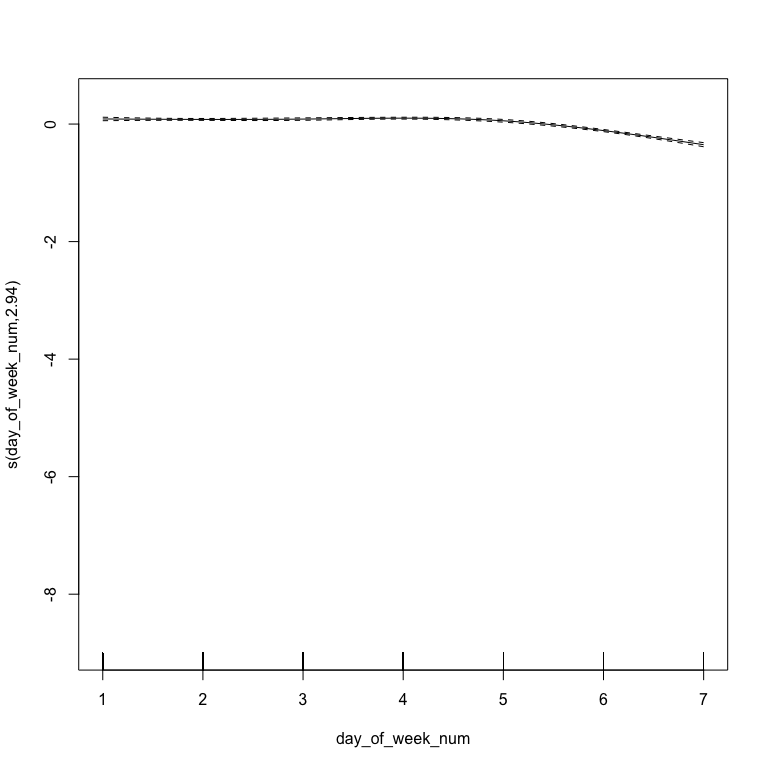<!-- -->

## Two-Dimensional Smooths

``` r
gam4 <- bam(
  formula = arrest ~ race + driver_gender +
    post_policy + race * post_policy +
    te(lon, lat),
  data = SC_for_analysis,
  family = "binomial"
)

summary(gam4)
```

    ## 
    ## Family: binomial 
    ## Link function: logit 
    ## 
    ## Formula:
    ## arrest ~ race + driver_gender + post_policy + race * post_policy + 
    ##     te(lon, lat)
    ## 
    ## Parametric coefficients:
    ##                          Estimate Std. Error z value Pr(>|z|)    
    ## (Intercept)              -4.92255    0.06034 -81.584  < 2e-16 ***
    ## raceBlack                 0.44380    0.07938   5.591 2.26e-08 ***
    ## raceHispanic              1.77309    0.09376  18.910  < 2e-16 ***
    ## driver_genderM            1.14264    0.03262  35.026  < 2e-16 ***
    ## post_policy               0.17137    0.05668   3.024   0.0025 ** 
    ## raceBlack:post_policy    -0.10085    0.08329  -1.211   0.2260    
    ## raceHispanic:post_policy -0.46476    0.10029  -4.634 3.58e-06 ***
    ## ---
    ## Signif. codes:  0 '***' 0.001 '**' 0.01 '*' 0.05 '.' 0.1 ' ' 1
    ## 
    ## Approximate significance of smooth terms:
    ##               edf Ref.df Chi.sq p-value    
    ## te(lon,lat) 21.26  22.37   1211  <2e-16 ***
    ## ---
    ## Signif. codes:  0 '***' 0.001 '**' 0.01 '*' 0.05 '.' 0.1 ' ' 1
    ## 
    ## R-sq.(adj) =  0.0193   Deviance explained = 5.85%
    ## fREML = 4.3e+05  Scale est. = 1         n = 301997

``` r
toPlot <- SC_for_analysis %>% filter(!is.na(lon) & !is.na(lat))

toPlot$predSpatial <- predict(gam4, newdata = toPlot, type="response")
```

``` r
gam.check(gam4)
```

<!-- -->

    ## 
    ## Method: fREML   Optimizer: perf newton
    ## full convergence after 6 iterations.
    ## Gradient range [3.131931e-07,2.1352e-05]
    ## (score 429997.5 & scale 1).
    ## Hessian positive definite, eigenvalue range [2.170075,3.098868].
    ## Model rank =  31 / 31 
    ## 
    ## Basis dimension (k) checking results. Low p-value (k-index<1) may
    ## indicate that k is too low, especially if edf is close to k'.
    ## 
    ##               k'  edf k-index p-value  
    ## te(lon,lat) 24.0 21.3    0.89    0.08 .
    ## ---
    ## Signif. codes:  0 '***' 0.001 '**' 0.01 '*' 0.05 '.' 0.1 ' ' 1

``` r
plot(gam4, rug = T)
```

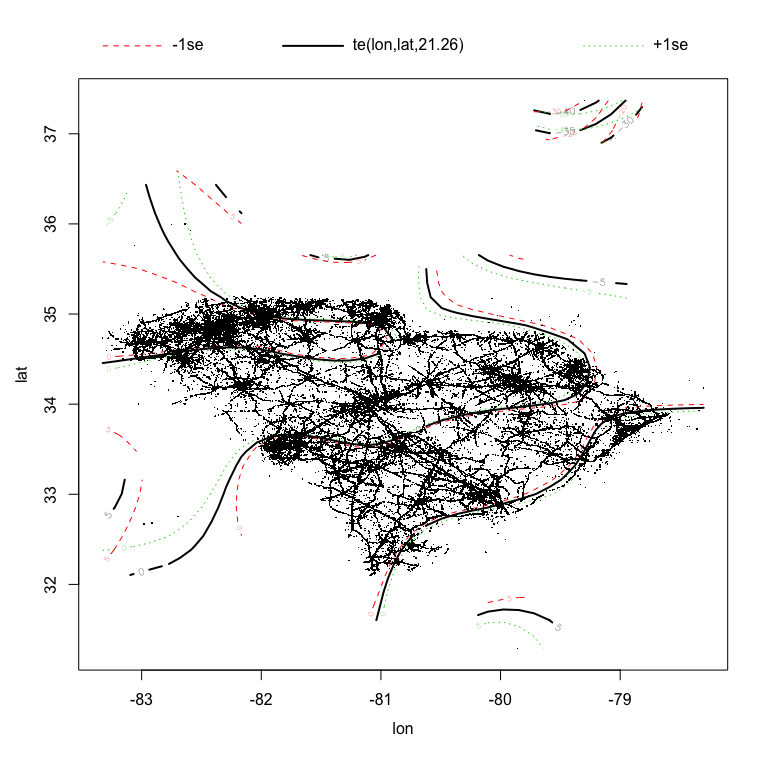<!-- -->

``` r
ggplot(subset(toPlot, predSpatial < 0.05), aes(lon, lat, col = predSpatial)) +
  geom_point(alpha = 0.5) +
  theme_minimal(base_size = 14) +
  theme(
    legend.title = element_blank(), # legend.position = "bottom" #,
    axis.text.x = element_text(angle = 30, hjust = 1)
  ) +
  ggtitle("Predicted Arrest Probability < 0.05")
```

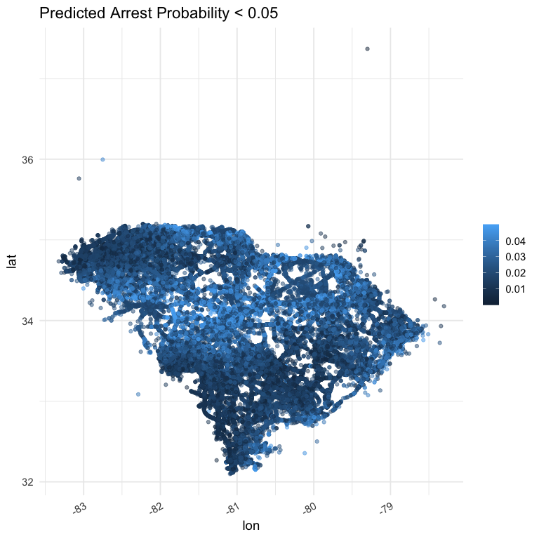<!-- -->

``` r
ggplot(subset(toPlot, predSpatial >= 0.05), aes(lon, lat, col = predSpatial)) +
  geom_point(alpha = 0.5) +
  theme_minimal(base_size = 14) +
  theme(
    legend.title = element_blank(), # legend.position = "bottom" #,
    axis.text.x = element_text(angle = 30, hjust = 1)
  ) +
  ggtitle("Predicted Arrest Probability >= 0.05")
```

<!-- -->

## Decomposition
